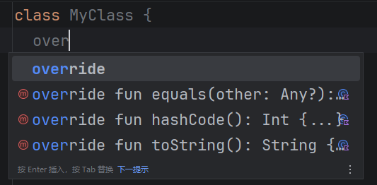

在 Kotlin 中，类默认是被 `final` 修饰的，一个类默认不可以作为继承对象。但其实默认情况下，所有的 Kotlin
类都有一个父类：`Any`。这个父类包含了：`equals`、`hashCode`、`toString` 三个成员函数，你可以选择实现或默认实现：



## `open` 类

我们想让一个类继承另一个类非常简单，只需要使用 `open` 关键字对类进行修饰即可：

```kotlin
// open 修饰一个类，让它可以继承
open class A {
  val msg: String = "Hello, World!"
  
  // open 修饰一个成员，可以让它变得可重写
  open fun getMessage(): String {
    return msg
  }
}

// 通过调用 A 的构造器实现继承
class B: A() {
  // 重写一个成员函数
  override fun getMessage(): String {
    // 通过 super 访问父级的成员
    return "B: ${super.getMessage()}"
  }
}

fun main() {
  // 输出：B: Hello, World!
  println(B().getMessage())
}
```

需要注意的是，`open` 类中的成员（属性 / 函数）必须提供值 / 实现。
