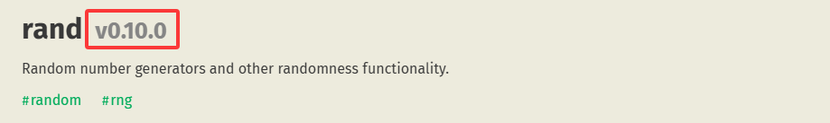

在上一节课[《Hello, World!》](/docs/backend/rust/primary/hello-world.html)中，我们创建并运行了第一个 Rust 程序，这节课，我们动手实现一个猜大小的程序，并且在这个过程中，我们简单了解一下 Rust 的基本语法。

## 一、创建一个项目

还记得我们是怎么创建项目的吗？没错，使用 `cargo new <project_name>` 或者在当前项目下使用 `cargo init` 来创建一个项目，我这里使用 `cargo new`：

```text
~\> mkdir learn_rust

~\> cd learn_rust

~\learn_rust> cargo new guess_number

~\learn_rust> cd guess_number

~\learn_rust\guess_number> rustrover .
```

项目的结构就不再展示，大家在 ide 里都能看得明白，我们打开 `src` 下的 `main.rs` 文件开始写代码。

## 二、理解需求

我们的需求是什么？是做一个猜大小的程序，那么我们需要做以下几件事：

- 确定一个随机数
- 让用户猜一个数
- 判断用户猜的数和我们确定的随机数是不是相同，给出相应的提示

我们先从简单的做起，接收用户输入的数字：

### 2.1 接收字符

Rust 为我们提供了标准库，通过标准库中的 IO（Input Output），我们可以输出、输入一段文字：

```rust
fn main() {
  println!("Hello, World!"); // 输出一段文字 // [!code focus]
}
```

我先写一遍该怎么接收用户的输入，接着我们再来一起分析代码：

```rust
fn main() {
  println!("猜数游戏！");
  
  println!("请输入您猜的数字：");
  
  let mut guess: String = String::new();
  
  std::io::stdin()
    .read_line(&mut guess)
    .expect("读行失败");
    
  println!("您猜的数是：{}", guess);
}
```

我们用 cargo run 运行这个项目，以后我们都不会用 `rustc` 来编译单独一个 `rs` 文件，而是使用 `cargo run` 来运行整个项目：

```text
~\learn_rust\guess_number> cargo run
    Finished `dev` profile [unoptimized + debuginfo] target(s) in 0.03s
     Running `target\debug\guess_number.exe`
猜数游戏！
请输入您猜的数字：
> 150
您猜的数是：150
```

好，我们来看一下我们写的这段代码：

```rust
fn main() {
  println!("猜数游戏！"); // 输出两段文字，这没什么好说的
  
  println!("请输入您猜的数字：");
  
  // 在这里，我们通过 `let mut` 定义了一个名为 `guess`，类型是 `String` 的变量
  // 我们可以通过 `let` 来定义变量，不过在 Rust 中，变量默认是不可变的
  // 我们可以加上 `mut` 关键字，声明一个可变的（mutable）变量
  let mut guess: String = String::new();
  // 通过 String::new() 来创建一个新的字符串（String）
  // 接下来的 stdin.read_line() 需要传入一个字符串
  // 在后面，我们会深入学习 String 字符串
  
  // 这里，我们用 stdin，要想用它我们有很多方法，这里我们使用一行就能用到它，
  // stdin 是 std 标准库 io 中的函数，我们就一层一层访问它，使用 `::`（路径符号）
  std::io::stdin()
    // 我们使用 stdin 下的 read_line 来读取下一行，并且传入 我们的 guess 变量
    // read_line 会修改这个变量，所以我们需要传入可变引用
    // 关于引用，我们会在后面的课程中讲解，大家看一遍就行了
    // 这里我们用 `.`（字段调用符） 来访问 read_line 函数
    .read_line(&mut guess)
    // 使用 expect 来捕获 read_line() 失败后的结果，我们不能保证 io 读取每次都成功
    .expect("读行失败");
    
  // 我们最后输出用户刚刚输入的内容，使用 `{}` 来拼接字符串
  println!("您猜的数是：{}", guess);
}
```

我们做了很多分析，看上去感觉很难，不过我们写的代码越多，这些东西我们会渐渐的熟能生巧。这里面有很多具体的知识点，我们会在后面的章节逐一展开学习。

接着，我们需要生成一个随机数，让用户来猜这个随机数：

### 2.2 生成随机数

该怎么生成随机数呢？Rust 标准库并没有为我们提供一个随机数生成器，不过我们可以引入一个名为 rand 的第三方库。我们有两种方法：

#### 2.2.1 手动添加 rand 依赖

我们先需要查看 rand 的最新版本，我们添加最新版本的依赖：

1. 访问 [crates.io](https://crates.io) 查看所有第三方依赖
2. 在网站的搜索位置搜索 `rand`
3. 在 [rand](https://crates.io/crates/rand) 页面上分查看 `v` 后面的数字



目前（2026/02/07），rand 库更新到了 v0.10.0 版本，那么我们在 `Cargo.toml` 文件中的 `dependencies` 节中加入 `rand = "0.10.0"` 这一行

:::code-group
```toml [Cargo.toml]
[package]
name = "guess_number"
version = "0.1.0"
edition = "2024"

[dependencies]
rand = "0.10.0" // [!code ++]
```
:::

不过我们更常用下面这种方法

#### 2.2.2 使用 cargo 安装依赖

cargo 为我们提供了 `cargo add` 来安装一个依赖，我们只需要在根目录处打开命令行，输入 `cargo add rand` 即可添加 rand 依赖：

```text
~\learn_rust\guess_number> cargo add rand
    Updating crates.io index
      Adding rand v0.10.0 to dependencies
...(+59 lines)
```

这样我们就添加好了 rand 依赖，cargo add 会自动为我们在 `Cargo.toml` 文件中添加 `rand` 这一行。

接着，我们在代码中使用它：

---

#### 使用 rand

我们可以使用 rand (0.10.0) 为我们提供了一个函数：`random_range`，需要传入一个范围，然后我们可以得到一个随机数：

```rust
fn main() {
  println!("猜数游戏！");
  
  let secret_number: i32 = rand::random_range(0..101); // [!code ++]
  println!("随机数是：{}", secret_number); // [!code ++]
  
  println!("请输入您猜的数字：");
  
  let mut guess: String = String::new();
  
  std::io::stdin()
    .read_line(&mut guess)
    .expect("读行失败");
    
  println!("您猜的数是：{}", guess);
}
```

我们使用了一个特殊的语法：`0..101`，这是 Rust 的范围表达式，用于表达 0 到 101 之间的数，但不包括 101。（详见[《基础概念 —— 范围表达式》](/docs/backend/rust/primary/concepts/range-expressions)）

`random_range` 这个函数会返回一个 `i32` 的整数类型，接下来，我们就需要比较用户猜的数字和我们的 `secret_number` 是不是一样的了。

### 2.3 比较大小

不过，Rust 是一个强类型的语言，如果我们直接比较 `guess` 是否等于 `secret_number` 是会报错的，我们需要把 `guess` 转换成同样的 `i32` 类型才可以和 `secret_number` 进行比较。

#### 2.3.1 将 guess 解析成数字

我们只需要写下面这一行代码，就可以把 `guess` 从 `String` 转换成 `i32` 类型：

```rust
fn main() {
  println!("猜数游戏！");
  
  let secret_number: i32 = rand::random_range(0..101);
  println!("随机数是：{}", secret_number);
  
  println!("请输入您猜的数字：");
  
  let mut guess: String = String::new();
  
  std::io::stdin()
    .read_line(&mut guess)
    .expect("读行失败");
    
  // 当然这里为了方便，我把一行代码给分开来了，这样看的也清晰一点：
  let guess: i32 = guess // [!code ++]
    .trim() // [!code ++]
    .parse::<i32>() // [!code ++]
    .expect("解析失败，请输入一个数字"); // [!code ++]
    
  println!("您猜的数是：{}", guess);
}
```

我们通过 `trim` 可以去除用户输入的所有空格，通过 `parse::<i32>` 可以指定将内容转换成 `i32` 类型。我们运行一下尝试尝试：

```text
~\learn_rust\guess_number> cargo run
    Finished `dev` profile [unoptimized + debuginfo] target(s) in 0.11s
     Running `target\debug\guess_number.exe`
猜数游戏！
随机数是：1
请输入您猜的数字：
你好

thread 'main' (21692) panicked at src\main.rs:19:8:
解析失败，请输入一个数字: ParseIntError { kind: InvalidDigit }
note: run with `RUST_BACKTRACE=1` environment variable to display a backtrace
error: process didn't exit successfully: `target\debug\guess_number.exe` (exit code: 101)

~\learn_rust\guess_number> cargo run
    Finished `dev` profile [unoptimized + debuginfo] target(s) in 0.05s
     Running `target\debug\guess_number.exe`
猜数游戏！
随机数是：67
请输入您猜的数字：
67
您猜的数是：67
```

我们先输了一段中文，中文没办法被解析成数字 (InvalidDigit)，所以它报错了，报错的内容和我们写的 `expect` 中的内容一样。后面，我们输入了数字，它被正常解析了。

#### 2.3.2 判断 guess 的大小

接着，我们需要判断 guess 和 secret_number 的大小关系，如果大了，我们就提示大了，如果小了，我们就提示小了，相等我们就可以恭喜用户。

我们可以通过 match 来进行匹配，我们来写一遍：

```rust
use std::cmp::Ordering; // [!code ++]

fn main() {
  println!("猜数游戏！");
    
  let secret_number: i32 = rand::random_range(0..101);
  println!("随机数是：{}", secret_number); // [!code --]
    
  println!("请输入您猜的数字：");
    
  let mut guess: String = String::new();
    
  std::io::stdin()
    .read_line(&mut guess)
    .expect("读行失败");
    
  let guess: i32 = guess
    .trim()
    .parse::<i32>()
    .expect("解析失败，请输入一个数字");
    
  println!("您猜的数是：{}", guess); // [!code --]
    
  match guess.cmp(&secret_number) { // [!code ++]
    Ordering::Greater => println!("大了！"), // [!code ++]
    Ordering::Equal => println!("恭喜你，猜对了！"), // [!code ++]
    Ordering::Less => println!("小了！") // [!code ++]
  }
}
```

我们使用 guess.cmp（compare）并传入需要对比的数，然后会返回一个 `Option<Ordering>`，它有三个项：Greater、Equal 和 Less，只需要填写对应的输出内容即可

> Option 详见[《结构体和枚举——枚举——Option和Result》](/docs/backend/rust/primary/struct-and-enums/enums/option-and-result)，目前只需要了解即可

我们运行一下试一试：

```text
~\learn_rust\guess_number> cargo run
   Compiling guess_number v0.1.0
    Finished `dev` profile [unoptimized + debuginfo] target(s) in 1.56s                                                                                                       
     Running `target\debug\guess_number.exe`
猜数游戏！
请输入您猜的数字：
25
小了！
```

我们猜完了一个数，不过猜完之后没有让我继续猜了，这是因为程序已经退出了，我们需要的是让用户一直猜，直到猜对为止，我们就需要使用到循环：

### 2.4 循环猜数

我们使用 loop 包裹声明 guess 变量到结尾的部分：

```rust
use std::cmp::Ordering;

fn main() {
  println!("猜数游戏！");
    
  let secret_number: i32 = rand::random_range(0..101);
    
  loop {// [!code ++]
    println!("请输入您猜的数字：");
        
    let mut guess: String = String::new();
    
    std::io::stdin()
      .read_line(&mut guess)
      .expect("读行失败");
        
    let guess: i32 = guess
      .trim()
      .parse::<i32>()
      .expect("解析失败，请输入一个数字");
        
    println!("您猜的数是：{}", guess);
        
    match guess.cmp(&secret_number) {
      Ordering::Greater => println!("大了！"),
      Ordering::Equal => {
        println!("恭喜你，猜对了！");
        break // 猜对之后使用 break 跳出 loop 循环 // [!code ++]
      },
      Ordering::Less => println!("小了！")
    }
  }// [!code ++]
}
```

最后，我们来试一下吧：

```text
~\learn_rust\guess_number> cargo run
    Finished `dev` profile [unoptimized + debuginfo] target(s) in 0.06s
     Running `target\debug\guess_number.exe`
猜数游戏！
请输入您猜的数字：
50
您猜的数是：50
大了！
请输入您猜的数字：
40
您猜的数是：40
大了！
请输入您猜的数字：
30
您猜的数是：30
大了！
请输入您猜的数字：
20
您猜的数是：20
小了！
请输入您猜的数字：
25
您猜的数是：25
恭喜你，猜对了！
```

这样，我们的猜数小游戏就算是完成了，不过这之中还有很多可以优化的地方，但是就交给未来的你来优化吧~

下一节课我们开始讲解一些基础的概念。